# 使用手册
## 如何访问SOCA平台
输入部署时设置的用户名和密码登录，即可进入SOCA平台主页面。
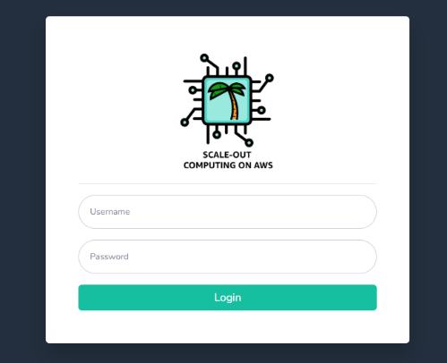 
您可以使用DCV（桌面云可视化）或通过SSH访问SOCA平台。
### SSH访问
要使用SSH协议访问SOCA平台，只需单击左侧导航栏中的“ SSH访问”，然后按照说明进行操作。您可以从SOCA平台下载PEM或PPK格式的私钥用于连接。
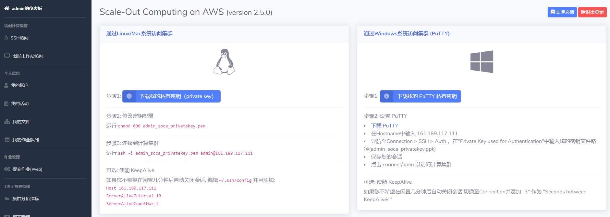 

### 使用DCV进行图形访问
要使用完整的远程桌面体验访问SOCA平台，请单击左侧导航栏中的“图形工作站访问”。默认情况下，您被授权最多同时建立4个图形工作站会话（EC2实例）。
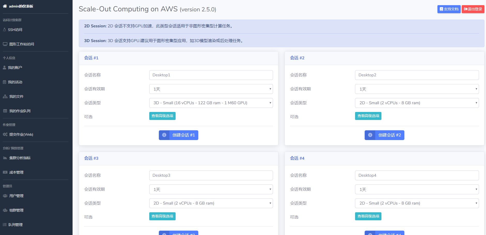 
设置图形工作站的运行时长和实例类型。点击“创建会话#”即可启动图形工作站会话的创建进程。
会话准备就绪后，该消息将自动更新为连接信息
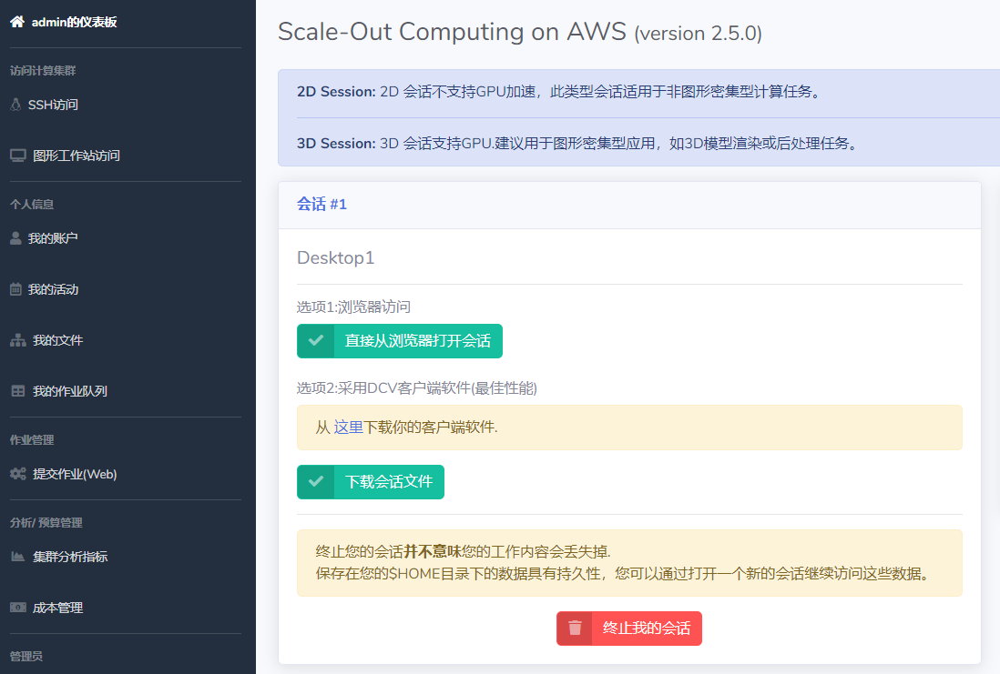 
可以点击“直接从浏览器打开会话”通过浏览器访问图形工作站的远程桌面。也可以下载DCV客户端软件，通过客户端访问图形工作站，以获得更佳的远程桌面操作体验。
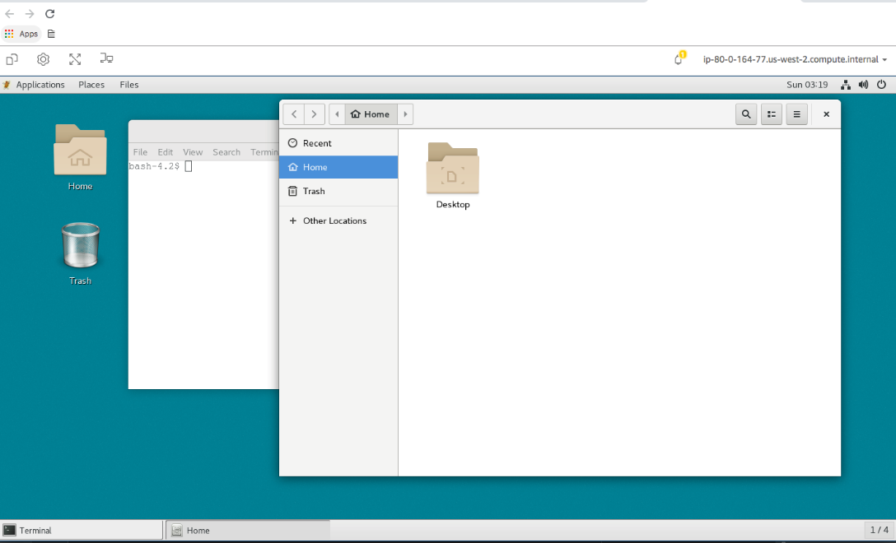 

## 如何配置SOCA平台
### 安装仿真软件
具体参考各仿真软件的安装指南，注：所有软件均需安装在/apps目录下。
### 管理队列
#### 1.新建/删除队列
SOCA平台默认创建了4个队列：high，normal (缺省)，low 和 alwayson。  
您也可以根据自己的需要创建新的队列或删除已有的队列。点击左侧导航栏的“队列管理”菜单。
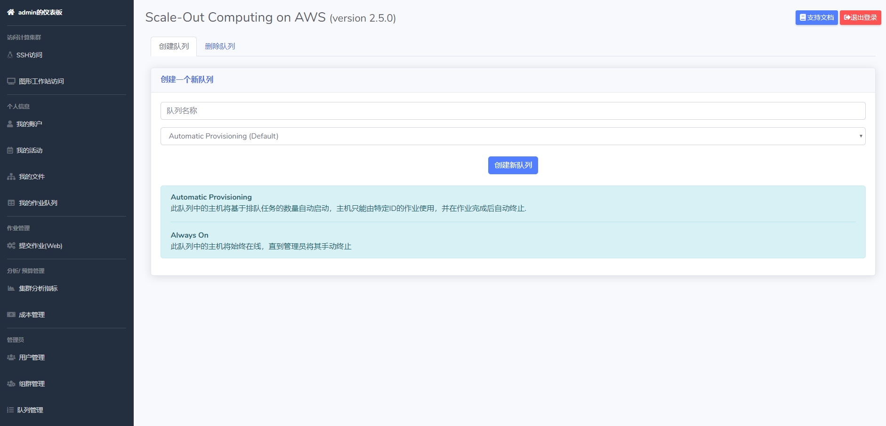 
在“创建队列”选项卡中输入队列名称，选择队列的模式（Automatic Provisioning和Always On模式）  
Automatic Provisioning——此队列中的主机将基于排队任务的数量自动启动，主机只能由特定ID的作业使用，并在作业完成后自动终止.  
Always On——此队列中的主机将始终在线，直到管理员将其手动终止  
点击“创建队列”即可在调度系统中新建一个队列。  
在“删除队列”选项卡中选择要删除的队列，勾选复选框，点击“删除队列”即可删除已有队列。  

#### 2.设置队列参数
根据需要修改下面队列配置文件，以更改队列参数。
`sudo nano /apps/soca/cluster_manager/settings/queue_mapping.yml`

- 设置新建Automatic Provisioning模式队列的配置参数
    - 选项1：使用与现有队列相同的设置。在这种情况下，只需使用新队列更新队列数组。
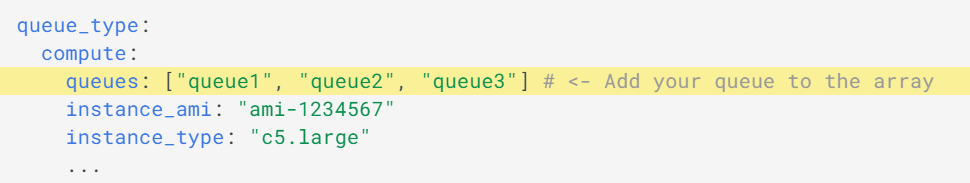 
    - 选项2：设置特定配置参数。在这种情况下，您首先需要在YAML文件上创建一个新队列类型，如下图中新加memory类型。
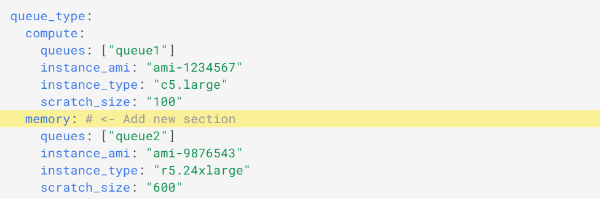 
    - 然后，以root身份，在调度器主节点上添加一个新的crontab。使用-c参数指定队列配置YAML文件的路径，-t参数指定您刚创建的队列类型名称。
```
*/3 * * * * source /etc/environment;  /apps/soca/$SOCA_CONFIGURATION/python/latest/bin/python3
/apps/soca/$SOCA_CONFIGURATION/cluster_manager/dispatcher.py -c
/apps/soca/$SOCA_CONFIGURATION/cluster_manager/settings/queue_mapping.yml -t memory
```

- 设置新建Always on模式队列的基础设施资源  
如果你新建的队列选择的是Always on模式，则需要手动的启动或关闭此队列所运行的基础设施资源。
    - 启动基础设施资源：  
运行python3 apps/soca/cluster_manager/add_nodes.py并启用--keep_forever True标识
```
# Launch 1 c5.large always on
python3 /apps/soca/$SOCA_CONFIGURATION/cluster_manager/add_nodes.py --instance_type c5.large \
    --desired_capacity 1 \
    --queue <queue_name> \
    --job_name instancealwayson \
    --job_owner mcrozes \
    --keep_forever True
```

    - 删除资源：  
只需转到您的CloudFormation控制台，按照命名约定找到堆栈：soca- cluster-name -keepforever- queue_name -uniqueid并终止它。
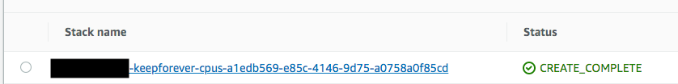 
- 限制谁可以提交工作  
仅允许特定的个人用户或/和LDAP组提交作业。您可以同时配置allowed_users或excluded_users来管理每个队列的ACL 
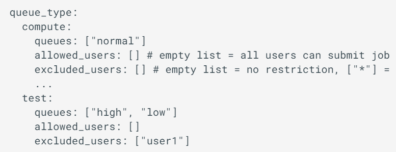 
在此示例中，user1可以将作业提交到“普通”队列，但不能提交到“高”或“低”队列。
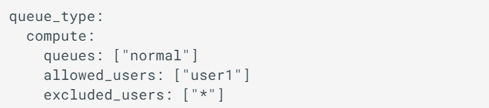 
在此示例中，user1是唯一有权提交作业的用户。
- 限制可以配置哪种类型的EC2实例  
控制可以为任何给定队列设置哪种类型的EC2实例。您可以同时配置allowed_instance_types和excluded_instance_types来管理每个队列允许的EC2实例类型。
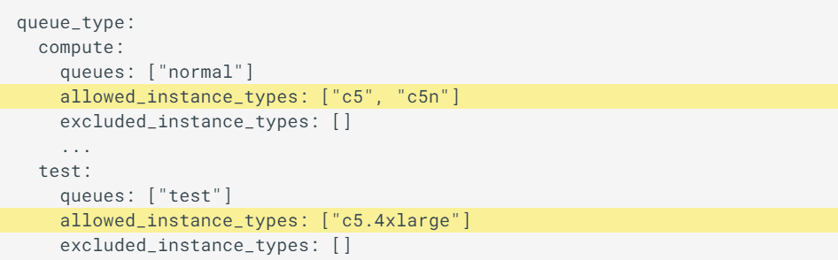 
在此示例中，只有c5和c5n系列中的EC2实例类型可用于提交到普通队列的作业。对于测试队列，仅允许使用c5.4xlarge实例类型。
- 限制并发作业或启动的实例数量
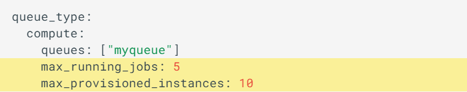 
在此示例中，“ myqueue”并发作业的最大数量为5。同时，作业不能请求超过10个实例

## 如何管理应用程序
不同的仿真应用程序具有不同的执行命令脚本和输入参数，可以在SOCA平台创建应用程序配置文件，通过简单的拖拽方式HPC管理员可以直观的、所见即所得的来构建自己的表单，而无需任何编码/ HTML经验。以使平台应用用户能够通过简单的Web界面提交HPC作业。
### 创建应用
规划仿真应用的输入参数有哪些，从而确定输入参数表单的内容。  
点击左侧导航栏中的“应用管理”菜单，选择“创建新应用”选项卡。在“步骤1：设计参数表单“选项卡中开始构建HTML表单。
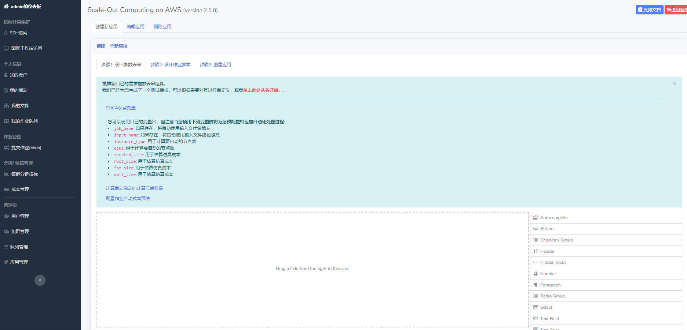 
如：从右侧组件列表中拖动“文本字段”组件，以将其添加到表单。  
配置widget，将关联的变量名（在此示例中为job_name）设置为名称（红色方框部分）。  
在下面的示例中，用户在job_name 中输入的值将被发送到作业脚本并通过 ％job_name％读取。
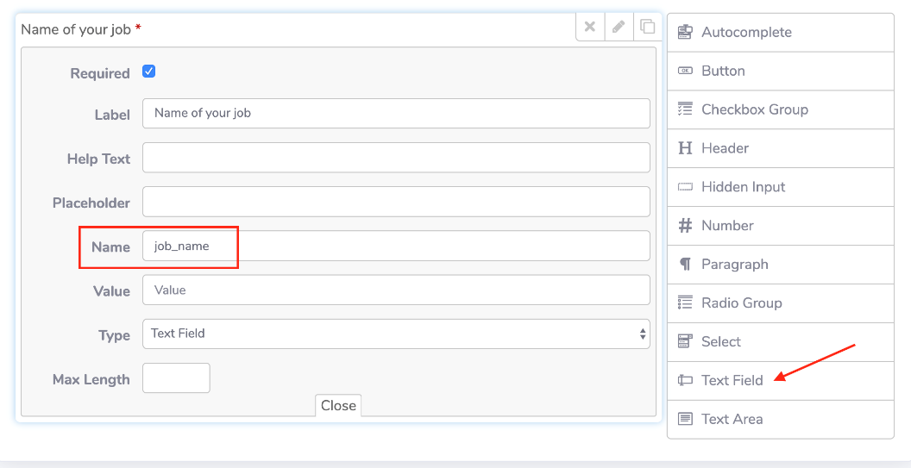 
重复其它参数的设置，可灵活选择不同的组件类型，如下拉框，复选框，文本输入框等。  
点击“步骤2：设计作业脚本”选项卡，输入作业执行脚本。
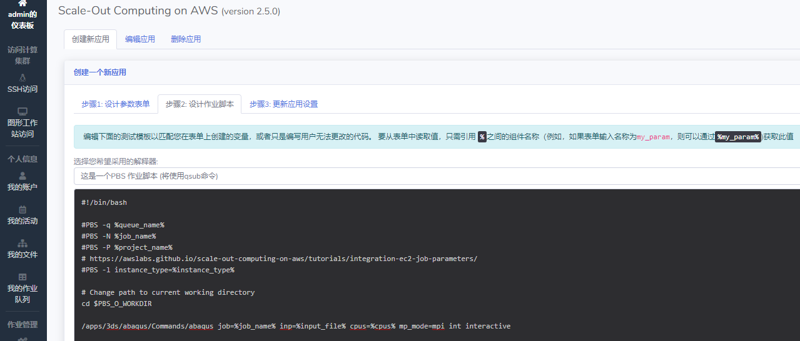 
点击“步骤3：更新应用设置”给新建的应用命名，并选择相应的图片作为此应用在SOCA平台应用列表中显示的缩略图。点击“更新此应用”之后SOCA平台的用户就可以直接在应用列表中选择并点击相应的图标执行应用程序。
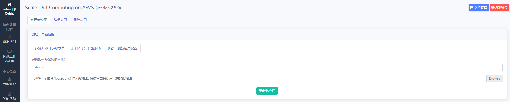 
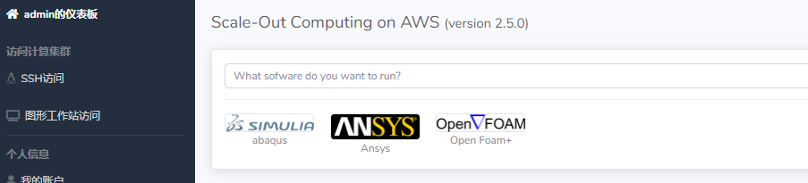 

## 如何管理用户/组及相应的权限
注：用户和组管理仅限于管理员用户  
点击左侧导航栏中的“用户管理”和“组群管理”菜单。  
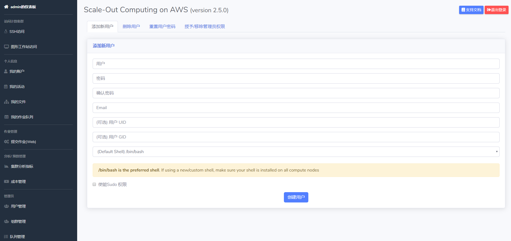 
### 新建用户
要创建新用户，只需填写“添加新用户”表单。通过选中“启用Sudo访问”复选框来选择用户是否为管理员。如果需要，您还可以手动强制UID / GID。
### 删除用户
要删除用户，请导航至“删除用户”部分，然后选择要删除的用户并选中复选框
### 重置给定用户的密码
用户可以通过Web ui更改自己的密码。如果需要，管理员还可以通过代表用户重置密码来临时解锁用户。
### 管理SUDO（管理员权限）
管理员可以为任何用户授予/撤消SUDO权限：
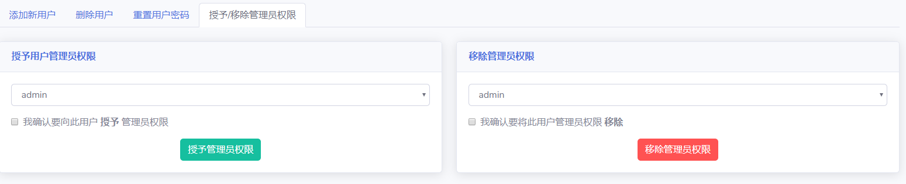 
### 创建一个新组
要创建新组，只需选择“创建组”，然后选择要添加到该组的用户
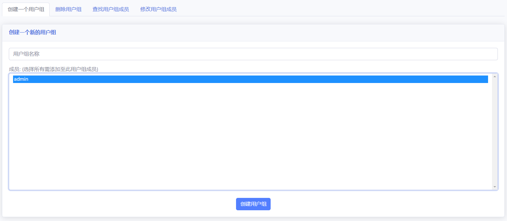 
### 查找用户组成员
您可以通过转到“查找组成员”选项卡来查找成员所在组。
### 变更群组成员
如果需要，您可以添加/删除给定组中的用户。
### 删除群组
最后，要删除组，只需导航至“删除组”选项卡。


## 使用自定义域名通过https访问
直接使用CloudFormation输出的ALB地址访问时，浏览器会提示访问不安全，这是因为没有正确配置https的证书。  
### 步骤1、配置AWS Certificate Manager(ACM)证书
进入[ACM](https://cn-northwest-1.console.amazonaws.cn/acm/home?region=cn-northwest-1)控制台。
#### 方式1、在AWS内申请
点击`请求证书`，选择`请求公有证书`，再点击`请求证书`，输入域名，点击`下一步`，根据自身情况选择验证方式。验证通过后，即可在证书管理里看到对应的证书。
#### 方式2、已有证书/导入证书
点击`导入证书`，在对应的框中，粘贴对应的内容即可。
### 步骤2、ALB选择ACM证书
进入[负载均衡器控制台](https://cn-northwest-1.console.amazonaws.cn/ec2/v2/home?region=cn-northwest-1#LoadBalancers:sort=loadBalancerName)，找到SOCA的负载均衡器，选中，然后点击`侦听器`页签，选择`HTTPS:443`对应的`查看/编辑证书`，点击`Certificates`右边的`+`按钮，选择上一节申请或导入的证书，再点击`add`。
### 步骤3、修改自定义域名的CNAME
进入客户自己的域名管理控制台，设置域名解析，把CNAME指向ALB的DNS名称即可。
### 步骤4、验证
在浏览器中，使用`https://自定义域名`访问。
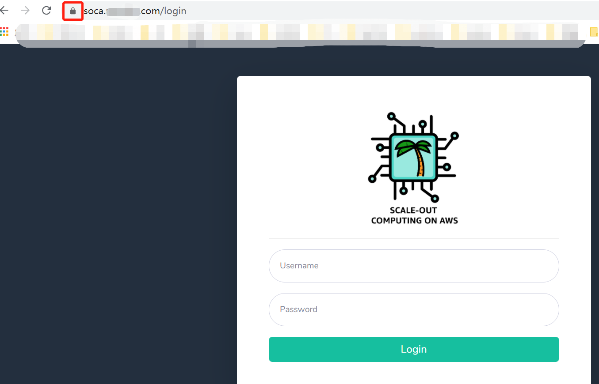
